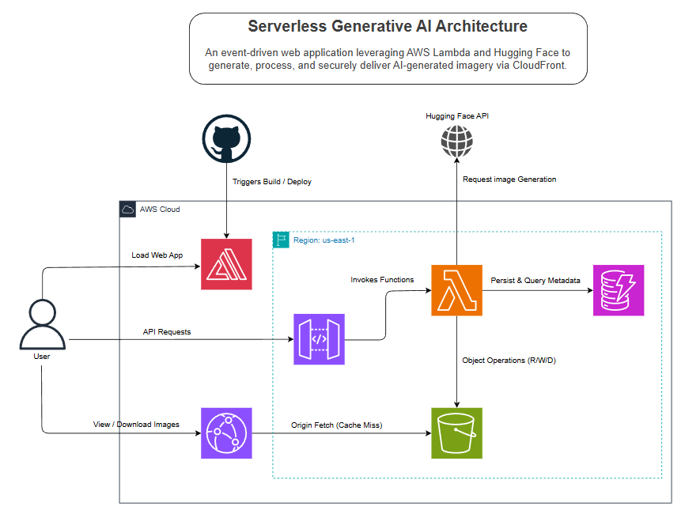

<div id="readme-top" align="center">

  

  <h1>AI Image Hive - Serverless Generative AI Application</h1>

  <p>A serverless, event-driven AI image generation platform built on AWS and React.</p>

</div>
<br />

<!-- Table of Contents -->
# :notebook_with_decorative_cover: Table of Contents  <!-- omit in toc -->

- [:star2: About the Project](#star2-about-the-project)
  - [📖 Overview](#-overview)
  - [:camera: Screenshots](#camera-screenshots)
- [👾 Tech Stack](#-tech-stack)
- [🏗️ Architecture](#️-architecture)
  - [🎨 Architecture Diagram](#-architecture-diagram)
  - [:dart: Features](#dart-features)
  - [💰 Cost Considerations](#-cost-considerations)
  - [🔐 Security \& Permissions](#-security--permissions)
- [🧠 Challenges \& Learnings](#-challenges--learnings)
- [🔮 Future Improvements](#-future-improvements)
- [:toolbox: Getting Started](#toolbox-getting-started)
  - [:bangbang: Prerequisites](#bangbang-prerequisites)
  - [☁️ AWS Backend Setup](#️-aws-backend-setup)
  - [:key: Environment Variables](#key-environment-variables)
  - [:gear: Installation](#gear-installation)
  - [:running: Run Locally](#running-run-locally)
  - [🗑️ Cleanup](#️-cleanup)
- [:wave: Contributing](#wave-contributing)
- [❔ FAQ](#-faq)
- [:warning: License](#warning-license)
- [:gem: Acknowledgements](#gem-acknowledgements)


<!-- About the Project -->
## :star2: About the Project

### 📖 Overview
AI Image Hive is a serverless, event-driven web application that allows users to generate high-fidelity artwork from text prompts using state-of-the-art open-source models. Re-architected from a traditional MERN stack to a cloud-native AWS architecture, this project serves as a modern blueprint for building scalable AI tools.

**Why I built it:** My primary goal was to gain hands-on experience with Cloud Computing and AI Integration. I wanted to move beyond simple CRUD apps and learn how to orchestrate real-world services like AWS Lambda, S3, and CloudFront to build a system that is both scalable and cost-effective.

**The Problem it Solves:**
- **Free Alternative:** This tool serves as a reliable backup for users who have exhausted their free credits on major platforms (like ChatGPT or Gemini), allowing them to continue generating high-quality images for free using open-source models.
- **Cost Efficiency:** By utilizing a serverless architecture, the application scales to zero—meaning if no one uses the app, the infrastructure cost is effectively $0.
- **Model Freedom:** It integrates directly with the Hugging Face Inference API to access powerful models like *FLUX.1-dev* and *Stable Diffusion*, bypassing the paywalls of proprietary systems.

<!-- Screenshots -->
### :camera: Screenshots

<div align="center" style="margin-bottom: 80px;">
  <div style="margin-bottom: 40px;">
    <h3>Home Page</h3>
    
    <h3>Create Page</h3>
    
  </div>
</div>

<!-- TechStack -->
## 👾 Tech Stack

#### Frontend   <!-- omit in toc -->
* **Framework:** React + Vite
* **Language:** JavaScript (ES6+)
* **Styling:** Tailwind CSS
* **HTTP Client:** Axios
* **Hosting:** AWS Amplify

#### Backend (AWS)   <!-- omit in toc -->
* **Compute:** AWS Lambda (Node.js)
* **API:** Amazon API Gateway
* **Database:** Amazon DynamoDB (Single Table Design with GSI)
* **Storage:** Amazon S3
* **CDN:** Amazon CloudFront

#### Other Services   <!-- omit in toc -->
- **Image Generation:** Hugging Face (Inference API)

## 🏗️ Architecture

### 🎨 Architecture Diagram


The system follows a strictly decoupled **Event-Driven Architecture**:
1. **Frontend:** React (Vite) hosted on *AWS Amplify*.
2. **API Layer:** *Amazon API Gateway* (REST) routes requests to *Lambda*.
3. **Compute (Lambda):**
   * `generate-image-function`: Calls Hugging Face, saves to *S3* (`drafts/`).
   * `share-image-function`: Moves objects from *S3* (`drafts/`) → (`feed/`) and puts the item into DB.
   * `get-feed-function`: Queries *DynamoDB* Index for the latest public posts.
4. **Storage:**
   * **S3:** Stores raw image assets (PNG).
   * **DynamoDB:** Stores metadata (imageId, name (author), prompt, imageUrl, createdAt, type).
5. **Delivery:** *CloudFront* CDN caches images from *S3*.

### :dart: Features
- **Text-to-Image Generation:** Utilizes Hugging Face Inference API (FLUX.1-dev) for state-of-the-art image generation.
- **Serverless Backend:** Built entirely on AWS Lambda, API Gateway, and DynamoDB for zero-idle costs.
- **Smart Caching:** Delivers images via **Amazon CloudFront** backed by **S3** for low-latency global access.
- **Mock Mode:** Includes a cost-saving "Mock Mode" for development testing (triggered by appending `#MOCK#` to prompts).
- **Feed & Sharing:** Users can publish generated drafts to a public community feed.
- **Responsive Design**: A mobile-first UI built with React + Vite that works seamlessly across all device sizes.
- **Dark/Light Mode**: Supports dark or light theme switching.

### 💰 Cost Considerations
This project is designed to run within the **AWS Free Tier**:
* **Compute:** AWS Lambda provides 400,000 GB-seconds of compute time per month for free.
* **Database:** DynamoDB offers 25GB of storage and 25 Read/Write capacity units for free.
* **Storage:** S3 Standard allows 5GB of storage for the first 12 months.
* **CDN:** CloudFront offers 1TB of data transfer out for free.
* **Zero Idle Cost:** Since the architecture is serverless, you are not charged when the application is not in use (Scale-to-Zero).
* **Hugging Face:** The project uses Hugging Face free tier Inference API, which offers around 4-6 image generations per month for free.
  
### 🔐 Security & Permissions
This project adheres to the **Principle of Least Privilege**. No generic admin roles are used.
* **Lambda Roles:** Each function has a unique IAM Role with inline policies (as in `policy.json`) restricted to specific resources (e.g., `s3:PutObject` only on `/drafts`).
* **CORS:** API Gateway is configured to restrict access to the specific Amplify frontend domain.
* **Environment Variables:** API Keys (Hugging Face) are stored securely in Lambda Environment Variables.


## 🧠 Challenges & Learnings
* **The "3-Second Wall":** Initially, the Lambda function timed out because AWS sets a default 3-second limit, while AI generation takes ~10-15s. I learned to configure Lambda timeouts and memory allocation (512MB) to handle long-running tasks.
* **CORS Hell:** Connecting a local frontend to a cloud backend triggered CORS errors. I solved this by configuring strict CORS headers in API Gateway to allow only my specific frontend domains.
* **S3/CloudFront Asset Delivery:** Configuring CORS for the S3 bucket and CloudFront was essential to allow users to view and **download** generated images directly from the CDN without permission errors.
* **Amplify Polyrepo Deployment:** Since the project is structured as a polyrepo (separate frontend and backend folders), I had to custom-configure the `amplify.yml` build settings to ensure Amplify correctly targeted the `client/` directory for deployment.
* **Efficient Database Querying:** To avoid the performance and cost pitfalls of the DynamoDB `Scan` operation, I implemented a Global Secondary Index (GSI). This allowed me to efficiently query the community feed based on status and creation time.
* **Serverless Development Shift:** Adopting the AWS Lambda programming model was a significant shift from traditional Express-based backends, requiring me to learn how to handle event objects, context, and stateless execution.

## 🔮 Future Improvements
- [ ] Add User Authentication via AWS Cognito.
- [ ] Image moderation pipeline.
- [ ] Asynchronous Image Generation with SNS + SQS.
- [ ] Implement AI model selection (Switch between FLUX, SDXL).
- [ ] Community ranking for images.

<!-- Getting Started -->
## 	:toolbox: Getting Started

<!-- Prerequisites -->
### :bangbang: Prerequisites
- Git
- Node.js (v18+)
- AWS Account & CLI configured
- Hugging Face API Token

### ☁️ AWS Backend Setup
Since this project uses a serverless architecture, you must provision the backend resources before running the frontend.

#### 1. DynamoDB Setup   <!-- omit in toc -->
1. Go to the **AWS DynamoDB Console** and create a table:
   * **Table Name:** `AI-Image-Hive`
   * **Partition Key:** `imageId` (String)
2. Create a **Global Secondary Index (GSI)** in the "Indexes" tab:
   * **Index Name:** `type-createdAt-index`
   * **Partition Key:** `type` (String)
   * **Sort Key:** `createdAt` (String)

#### 2. S3 Bucket Setup   <!-- omit in toc -->
1. Create a generic S3 bucket (e.g., `my-unique-app-name-assets`).
2. Create two folders inside: `drafts/` and `feed/`.
3. Make sure to add a lifecycle rule to delete objects in `drafts/` after 1 day to save storage costs.
4. **CORS Configuration:** Go to the **Permissions** tab, scroll to CORS, and paste this JSON:
```json
[
  {
    "AllowedHeaders": ["*"],
    "AllowedMethods": ["GET", "PUT", "POST", "HEAD"],
    "AllowedOrigins": ["*"], // Change this to your frontend domain in production
    "ExposeHeaders": []
  }
]
```

#### 3. Lambda Functions      <!-- omit in toc -->
Create 3 Node.js functions in the AWS Console and paste the code from the `lambda/` folder in this repo:

* **`generate-image-function`**:
  * **Code:** Paste from `lambda/generate-image/index.mjs`
  * **Config:** Increase Timeout to **1 min 0 sec** and Memory to **512 MB**.
* **`share-image-function`**:
  * **Code:** Paste from `lambda/share-image/index.mjs`
* **`get-feed-function`**:
  * **Code:** Paste from `lambda/get-feed/index.mjs`

Make Sure to set the required environment variables for each function as present in `lambda/<function-name>/.env.example`.

#### 4. IAM Permissions      <!-- omit in toc -->
The Lambda functions created in the previous step will fail without specific permissions.
1. Go to the **IAM Console** -> **Roles**.
2. Locate the execution roles for your Lambda functions.
3. Attach the inline policies for each role from the respective `lambda/<function-name>/policy.json` file in this repo, updating the resource ARNs to match your AWS services.

#### 5. API Gateway      <!-- omit in toc -->
1. Create a **REST API**.
2. Create resources: `/generate` (POST), `/posts` (POST) shares to community, `/posts` (GET) get all the images for home feed.
3. Connect each method to its respective Lambda function.
4. **Enable CORS:** In the left sidebar, click on "CORS". Configure it to allow your frontend domain.
5. **Deploy:** Click **Deploy API**, create a stage (e.g., `dev`), and copy the **Invoke URL**.

#### 6. CloudFront Setup (CDN)      <!-- omit in toc -->
1. Go to **CloudFront** -> **Create Distribution**.
2. **Origin domain:** Select your S3 bucket.
3. **Origin access:** Select **Origin access control settings (OAC)** -> Create control setting.
4. After creation, copy the generated **Bucket Policy** and update your **S3 Bucket Permissions** to allow CloudFront access.

#### 7. Frontend Deployment (Amplify - Optional)      <!-- omit in toc -->
1. Go to **AWS Amplify Console** -> **Create new app**.
2. Select **GitHub** and authorize the repository.
3. Choose the main branch. Amplify will auto-detect the Vite/React build settings.
4. Click **Save and Deploy**.

<!-- Env Variables -->
### :key: Environment Variables
To run this project, you will need to add the following environment variables to your `.env` file.

#### Frontend   <!-- omit in toc -->
Keep these in AWS Amplify's environment variables or in `client/.env` file if running locally.
- `VITE_BACKEND_URL_DEV` - Your backend server URL / same as below
- `VITE_BACKEND_URL_PROD` - API Gateway's default endpoint

#### Backend   <!-- omit in toc -->
Keep these in the respective lambda function's environment variables.
- `TABLE_NAME` - Your DynamoDB table name.
- `INDEX_NAME` - Your DynamoDB GSI name.
- `BUCKET_NAME` - Your bucket name.
- `CLOUDFRONT_URL` - Your CloudFront distribution URL.
- `HUGGINGFACE_API_KEY`: Your Hugging Face API key for accessing image generation.

<!-- Installation -->
### :gear: Installation
To install and set up the project locally, follow these steps:

1. **Clone the Repository:**
```bash
git clone https://github.com/Adhik-6/image_generator.git
cd image_generator
```
2. **Set Up Environment Variables:**  
Create a `.env` file in the root directory and add the required variables as described above.
3. **Install client dependencies:**
```bash
cd client
npm i
```
4. **Run the Frontend:**
```bash
npm run dev
```
5. **Testing without Inference API:**
To test the flow without using API credits or waiting for GPU generation, append `#MOCK#` to your prompt:
- **Input:** "A cyberpunk cat #MOCK#"
- **Result:** Returns a pre-loaded placeholder image (1x1 red block) instantly.
   
<!-- Run Locally -->
### :running: Run Locally

1. **Build the client:**
```bash
npm run dev --prefix client
```

2. **Start the server:**
```bash
npm run dev
```


### 🗑️ Cleanup
To avoid incurring future charges, remember to delete resources if you are done with the project:
1. **Empty and Delete S3 Buckets:** S3 buckets must be empty before deletion.
2. **Delete DynamoDB Table:** Remove the `AI-Image-Hive` table.
3. **Remove Lambda Functions:** Delete the 3 functions created.
4. **Delete API Gateway:** Remove the REST API.
5. **Delete CloudFront Distribution:** Remove the CloudFront distribution.
6. **Delete Amplify App:** If deployed, delete the Amplify app.
7. **Delete IAM Roles:** Remove any IAM roles created for Lambda functions and other services as they won't be used again.

<!-- CONTRIBUTING -->
## :wave: Contributing
Contributions are what make the open source community such an amazing place to learn, inspire, and create. Any contributions you make are **greatly appreciated**.

If you have a suggestion that would make this better, please fork the repo and create a pull request. You can also simply open an issue with the tag "enhancement".
Don't forget to give the project a star! Thanks again!

1. Fork the Project
2. Create your Feature Branch (`git checkout -b feature/AmazingFeature`)
3. Commit your Changes (`git commit -m 'Add some AmazingFeature'`)
4. Push to the Branch (`git push origin feature/AmazingFeature`)
5. Open a Pull Request

<!-- FAQ -->
## ❔ FAQ
- **Where are the generated images stored?**
  + Images are stored in Amazon S3 and delivered via CloudFront for high performance.

- **Why is the generation slow sometimes?**
  + The Hugging Face Inference API (Free Tier) uses a queue system. If the queue is busy, generation might take 10-20 seconds. Use #MOCK# mode for instant UI testing.

- **Can I deploy this project to my own AWS account?**
  + Yes! The amplify.yml and lambda function code are included. You will need to manually set up the S3 Bucket, DynamoDB Table, and API Gateway resources.

- **What should I do if the live site is unavailable?**
  + The site relies on the Hugging Face Free Tier API. If their model is overloaded, the generation might fail temporarily.


<!-- License -->
## :warning: License
Distributed under the no License.

<!-- Acknowledgments -->
## :gem: Acknowledgements
- [AWS Cloud Quest](https://aws.amazon.com/training/cloud-quest/) - For getting me started with AWS services
- [Hugging Face](https://huggingface.co/) - For providing amazing open source models and APIs
- [FreeCodeCamp](https://www.freecodecamp.org/) - For tutorials on React and AWS
- [ChatGPT](https://chat.openai.com/) - For helping with code snippets and debugging
- [Gemini](https://gemini.google.com/) - For helping with refactoring and optimizing code


<p align="right">(<a href="#readme-top">back to top</a>)</p>
